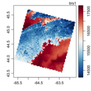

The images shown below illustrate a few of the things Oce can do; click on an
image to enlarge it, or click the title above the image to see the R code that
created it.

[`ctd`](oce-demo-1.html)
](http://dankelley.github.io/oce/oce-demo-1.png)

Code Link | Example
--------- | -------
[`ctd`](oce-demo-1.html) | 

<table class="galleryitem">
    <tr><td><a href="oce-demo-1.html">CTD</a></td></tr>
    <tr><td></td></tr>
</table>

<table class="galleryitem">
    <tr><td><a href="oce-demo-2.html">ADCP</a></td></tr>
    <tr><td></td></tr>
</table>

<table class="galleryitem">
    <tr><td><a href="oce-demo-3.html">Sealevel</a></td></tr>
    <tr><td></td></tr>
</table>

<table class="galleryitem">
    <tr><td><a href="oce-demo-4.html">Echosounder</a></td></tr>
    <tr><td></td></tr>
</table>

<table class="galleryitem">
    <tr><td><a href="oce-demo-5.html">Map</a></td></tr>
    <tr><td></td></tr>
</table>

<table class="galleryitem">
    <tr><td><a href="oce-demo-6.html">Landsat</a></td></tr>
    <tr><td></td></tr>
</table>

